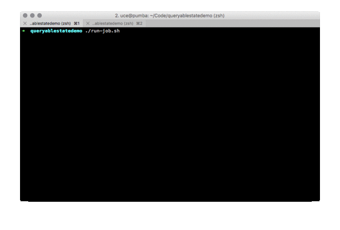

## Apache Flink Queryable State Demo

This repository contains a short demo of Apache Flink's Queryable State feature. You can check out the [Flink documentation](https://ci.apache.org/projects/flink/flink-docs-release-1.2/dev/stream/queryable_state.html) for [more details about Queryable State](https://ci.apache.org/projects/flink/flink-docs-release-1.2/dev/stream/queryable_state.html).

### Getting Started

0. **Requirements**

- Git
- Java 8
- Maven 3

1. **Clone this repository.**

```bash
$ git clone https://github.com/dataArtisans/flink-queryable_state_demo.git
```

2. **Run the demo job.**

```bash
% ./run-job.sh
[info] Building demo JAR... this can take a few seconds.
[info] Done. Demo JAR created in target/queryablestatedemo-1.0.jar.
[info] Executing EventCountJob from queryablestatedemo-1.0.jar (exit via Control+C)
[info] Job ID: 2488a115d832013edbbd5a6599e49e45

Generating 454435 elements per second
Generating 880747 elements per second
Generating 903855 elements per second
```

3. **Run the demo query client.**

```bash
./run-query-repl.sh 2488a115d832013edbbd5a6599e49e45
[info] Querying job with ID '2488a115d832013edbbd5a6599e49e45'
[info] Executing EventCountClient from queryablestatedemo-1.0.jar (exit via Control+C)

Using JobManager localhost:6124
Enter a key to query.

The EventCountJob itemCounts state instance has String keys that are three characters long and alphanumeric, e.g. 'AP2' or 'LOL'.

$ ABC
[info] Querying key 'abc'
446 (query took 99 ms)
$ ABC
[info] Querying key 'abc'
604 (query took 2 ms)
$ ABC
[info] Querying key 'abc'
631 (query took 1 ms)
$ ele
[info] Querying key 'ele'
834 (query took 2 ms)
$ notexistingkey
[info] Querying key 'notexistingkey'
Unknown key notexistingkey (query took 11 ms)
```



### Code

The code for this demo is found in the `src/main` directory under the package `com.dataartisans.queryablestatedemo`.

The two main classes are `EventCountJob` and `EventCountClient`.

#### EventCountJob

The `EventCountJob` is a simple job that generates random `BumpEvent` instances and counts how many counts happen per bumped item. The bump events model users interacting with items on a website and *liking* them.

```java
public class BumpEvent {

  // ID of the user bumping the item
  private final int userId;

  // Item being bumped
  private final String itemId;

}
```

The item IDs in our demo are *three character alphanumeric Strings* like `ABC` or `1A3`. The stream of `BumpEvent` instances is keyed by the `itemId` and the count is increased for each item.
 
```java
// Increment the count for each event (keyed on itemId)
FoldingStateDescriptor<BumpEvent, Long> countingState = new FoldingStateDescriptor<>(
    "itemCounts",
    0L,                       // Initial value is 0
    (acc, event) -> acc + 1L, // Increment for each event
    Long.class);

bumps.keyBy(BumpEvent::getItemId).asQueryableState("itemCounts", countingState);
```

The call to `asQueryableState(State, StateDescriptor)` exposes a queryable state stream that is identified via the name `itemCounts`. The `countingState` descriptor specifies a state instance that increments the count for each incoming event. Because we use a keyed stream here (the `keyBy`) each count is automatically scoped to the item ID. You can find more information about [Flink's state abstraction](https://ci.apache.org/projects/flink/flink-docs-release-1.2/dev/stream/state.html) in the documentation.

As soon as the job is running, the `itemCounts` state instance is available for queries. As part of this demo, you can use the included **`run-job.sh` script** which takes care of building the job and executing it. Make sure to note down the displayed JobID as you will need it for the query client below.

##### Exposing State for External Queries

As of Flink 1.2, we have two options for exposing state for queries.

1. **Queryable State Stream**: The above variant is a shorthand that we call a *queryable state stream*. The `asQueryableState` call is overloaded to allow different state variants like `ValueState` or `ReducingState`, allowing you to increment the state stream in different ways. 

2. **StateDescripor**. The other variant is to call  `setQueryable("itemCounts")` when creating a `StateDescriptor`. This is more flexible as you can expose any keyed state instance you are working with for queries. The following example is achieves the same result as the queryable state stream from above: 

```java
static class EventCounter<T> extends RichFlatMapFunction<T, Void> {

  // Flink's managed state for keeping track of the counts. The state is
  // automatically scoped to the item key and updates happen by key.
  private ReducingState<Long> runningCount;
  
  @Override
  public void open(Configuration config) throws Exception {
    // Reducing state that keeps a sum
    ReducingStateDescriptor<Long> stateDescriptor = new ReducingStateDescriptor<>(
        "itemCounts", (a, b) -> a + b, Long.class);
    
    // Mark state as queryable. This is how we expose the state instance
    // for external queries.
    stateDescriptor.setQueryable("itemCounts");
    
    this.runningCount = getRuntimeContext().getReducingState(stateDescriptor);
  }

  @Override
  public void flatMap(T event, Collector<Void> collector) throws Exception {
    // Increment the count for the current key
    runningCount.add(1L);
  }
}
```   

#### EventCountClient

The `EventCountClient` of this demo is a very simple REPL that queries the `itemCounts` state instance.

The `QueryClientHelper` takes care of setting up Flink's low level `QueryableStateClient` that was released with Flink 1.2.0. The `QueryableStateClient` is a fully asynchronous client that takes care of
 
1. **Location lookup**: communicate with the JobManager and look up the location of a queried key among the available TaskManager instances, and
2. **Network communication**: submitting the query via the network to a specific TaskManager.
 
This means that the client takes care of all communication with the Flink application. As a user, you only have to provide the following information: 

- **JobID**. The ID of the job to query (displayed by the demo job or found in the web UI)
- **Types**. The types of the queried keys and returned values (our keys are Strings and the returned counts are Longs, using the `StringSerializer` and `LongSerializer` respectively)

As part of this demo, the `EventCountClient` takes care of setting up the types and submitting the queries. You only have to provide the JobID.

You can use the included **`run-query-repl.sh` script** which takes care of building the client and executing it. It has the jobId of the running job as a required argument. 

If you want to have a look at how the `QueryableStateClient` is set up as part of this demo, check out the [QueryClientHelper](https://github.com/dataArtisans/flink-queryable_state_demo/blob/master/src/main/java/com/dataartisans/queryablestatedemo/QueryClientHelper.java) class.

The main query method is `Optional<V> queryState(String name, K key)`. The name for the demo is `itemCounts` and the keys are three character alphanumeric Strings like `AB1`. If a key is not available, the returned Optional will be empty.
